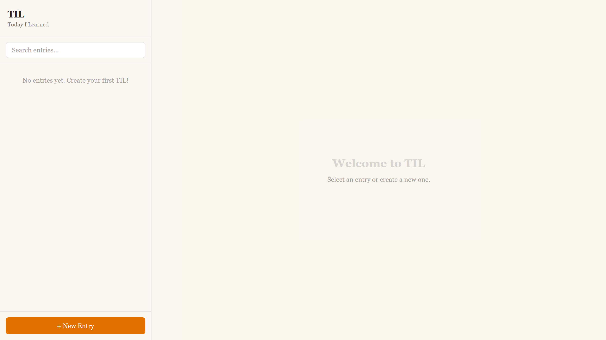

# TIL — Today I Learned

[](https://github.com/kamarajendra/til-micro-blog/actions/workflows/ci.yml)
[](https://github.com/kamarajendra/til-micro-blog/releases)
[](https://github.com/kamarajendra/til-micro-blog/blob/main/LICENSE)

A local-first Markdown-based micro-blog for capturing and organizing things you learn every day. All data stays in your browser.

## Screenshot



## Features

- Create, edit, and delete TIL entries
- Tag-based organization and filtering
- Full-text search across titles and content
- Markdown rendering for rich entries
- 100% client-side with localStorage persistence

## Tech Stack

- Next.js 16 App Router
- React 19
- TypeScript
- Tailwind CSS 4
- Vitest

## Getting Started

```bash
npm install
npm run dev
```

## License

MIT
